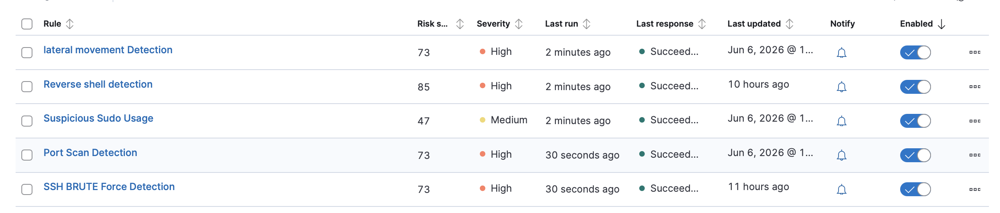
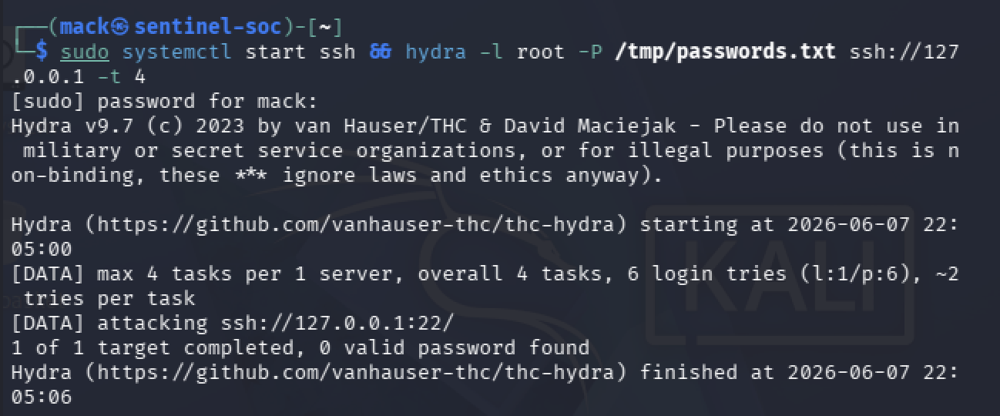
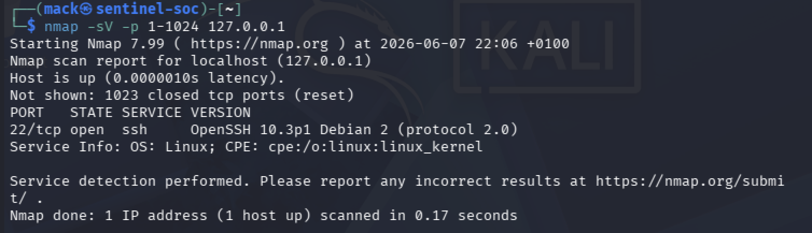

# Project Sentinel — SOC Home Lab
A fully functional Security Operations Centre (SOC) built on a Kali Linux VM, simulating real-world threat detection using the Elastic Stack.
## Architecture
## Tech Stack

| Tool | Version | Purpose |
|------|---------|---------|
| Elasticsearch | 8.19.16 | Data indexing & search |
| Kibana | 8.19.16 | SIEM & dashboards |
| Filebeat | 8.19.16 | Log shipping |
| Auditbeat | 8.19.16 | Process monitoring |
| Suricata | Latest | Network IDS |
| Hydra | 9.7 | Attack simulation |

## Detection Rules

| Rule Name | MITRE Technique | Severity | Status |
|-----------|----------------|----------|--------|
| SSH Brute Force Detection | T1110.001 | High | ✅ Active |
| Suspicious Sudo Usage | T1548.003 | Medium | ✅ Active |
| Port Scan Detection | T1046 | High | ✅ Active |
| Lateral Movement Detection | T1021 | High | ✅ Active |
| Reverse Shell Detection | T1059.004 | High | ✅ Active |

## Threat Hunt Case Study

See [docs/threat-hunt-01-ssh-brute.md](docs/threat-hunt-01-ssh-brute.md)

## Setup

See [docs/architecture.md](docs/architecture.md) for full setup instructions.

## What I Learned

- Building an end-to-end SIEM pipeline from scratch
- Writing KQL and EQL detection rules mapped to MITRE ATT&CK
- Simulating real attacks and validating detections
- Debugging Elasticsearch security and authentication issues
- Understanding how log ingestion, parsing, and alerting work together

## Future Improvements

- Add Logstash for advanced log parsing pipelines
- Integrate Cortex/TheHive for incident response workflow
- Add GeoIP enrichment for source IP mapping
- Build automated response playbooks

### Installed Detection Rules

*All 5 custom SIEM rules active with severity levels*

### Hydra Brute Force Simulation

*Hydra v9.7 performing SSH password spraying against localhost — generates the log events our rule detects*

### Nmap Port Scan Simulation

*Nmap service scan against localhost — simulating T1046 Network Service Discovery*
