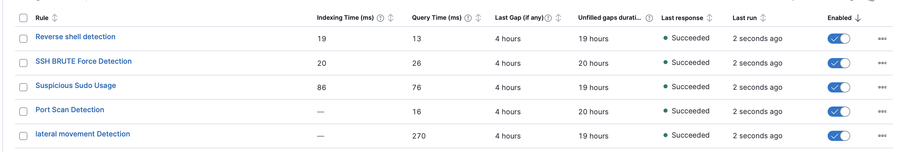
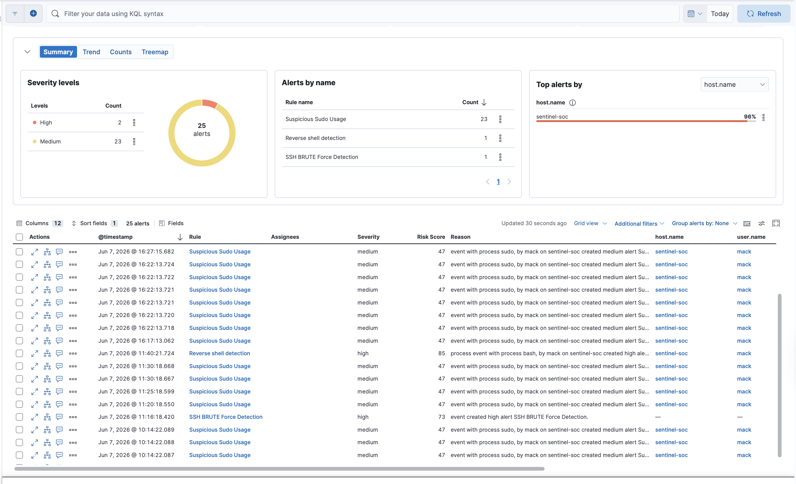

# MITRE ATT&CK Mapping — Project Sentinel

## Detection Coverage

| Rule Name | Tactic | Technique ID | Technique Name | Severity | Alert Fired |
|-----------|--------|-------------|----------------|----------|-------------|
| SSH Brute Force Detection | Credential Access | T1110.001 | Brute Force: Password Guessing | High | ✅ Yes |
| Suspicious Sudo Usage | Privilege Escalation | T1548.003 | Abuse Elevation Control Mechanism: Sudo | Medium | ✅ Yes |
| Port Scan Detection | Discovery | T1046 | Network Service Discovery | High | ⚠️ Partial |
| Lateral Movement Detection | Lateral Movement | T1021 | Remote Services | High | 🔄 Monitoring |
| Reverse Shell Detection | Execution | T1059.004 | Command and Scripting Interpreter: Unix Shell | High | ✅ Yes |

## Evidence

> All 5 rules active in Kibana Security → Detection Rules (SIEM)

> Live alerts from 3 rules firing during attack simulation

## Notes on Coverage

- **T1046 (Port Scan):** Rule created and active. Suricata monitors network interface — loopback scans don't trigger it. Would fire on real network traffic.
- **T1021 (Lateral Movement):** EQL sequence rule monitoring for remote login → shell spawn → /etc modification chain. Requires full Auditbeat enrichment.
- All rules exported to `detection-rules/rules_export.ndjson` and can be imported directly into any Kibana 8.x instance.
